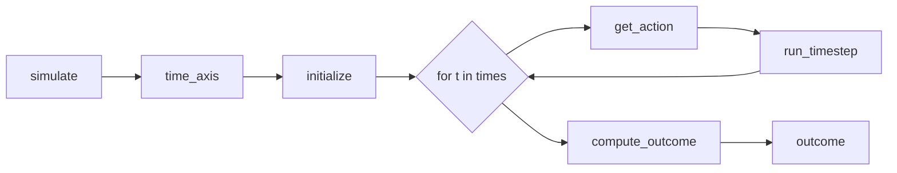

# Documentation TODO

Notes and tasks for improving the documentation.

## Sidebar Changes

- [ ] Change "Tutorial" → "Tutorial: House Elevation" in `docs/_quarto.yml` line 18

## Landing Page (`docs/index.qmd`)

- [ ] Replace "corny" opening: "SimOptDecisions helps you find good decision strategies when the future is uncertain."
  - New: "SimOptDecisions is a Julia framework for conducting exploratory modeling and simulation-optimization under uncertainty."
  - Next paragraph: "You provide a simulation model and parameterized policy. The framework runs your model, aggregates the results, and facilitates visualization and policy search."
  - Add: Designed to be flexible but imposes just enough structure to enable type stability, fast execution, and ergonomic APIs.

- [ ] Under "Key Vocabulary": Add note that "Scenario" is sometimes called "State of the World" (SOW) in the decision analysis literature

- [ ] "How It Works" section:
  - [ ] Remove the first ASCII box ("You define" types and callbacks) - redundant with Quick Reference
  - [ ] Keep the "Callback Flow" diagram - verify it's correct
  - [ ] Consider replacing ASCII callback flow with Mermaid or generated figure (left-to-right layout)

## The Problem Page (`docs/tutorial/01-the-problem.qmd`)

Currently pure prose. Needs to transition into explaining the code patterns:

- [ ] Explain `T<:AbstractFloat` - parametric types for type stability
- [ ] Explain `<:AbstractConfig`, `<:AbstractScenario`, etc. - how the framework knows your types
- [ ] Explain parameter types requirement (ContinuousParameter, etc.)

## Defining Your Model (`docs/tutorial/02-defining-your-model.qmd`)

**DONE** - Updated to use parameter types:

- [x] Update `HouseElevationConfig` - explain that Config can use plain types or parameters
- [x] Update `HouseElevationScenario` to use `ContinuousParameter` for all fields
- [x] Update `ElevationPolicy` to use `ContinuousParameter`
- [x] Update `sample_scenario()` to construct with parameters
- [x] Explain that parameter types enable:
  - Automatic bounds for optimization
  - Automatic flattening for exploratory modeling
  - Consistent visualization
  - Type-safe value extraction with `value()`

## Running a Simulation (`docs/tutorial/03-running-a-simulation.qmd`)

**DONE** - Updated to use parameter types:

- [x] Update type definitions to use `ContinuousParameter`
- [x] Update `run_timestep` to use `value()` for scenario parameters
- [x] Update `compute_outcome` to use `value()` for discount_rate
- [x] Update example code to construct policies with `ContinuousParameter`

## Remaining Tutorial Files

- [ ] Update `docs/tutorial/04-evaluating-a-policy.qmd` to use parameter types
- [ ] Update `docs/tutorial/05-exploratory-modeling.qmd` to use parameter types
- [ ] Update `docs/tutorial/06-policy-search.qmd` to use parameter types

## Parameter Types Documentation

Need a dedicated section or callout explaining:

- [ ] `ContinuousParameter{T}` - real values with optional bounds
- [ ] `DiscreteParameter{T}` - integer values with optional valid_values
- [ ] `CategoricalParameter{T}` - categorical with defined levels
- [ ] `TimeSeriesParameter{T,I}` - time-indexed data that can be reused across different simulation horizons
  - Takes `time_axis` and `values` arguments
  - Indexes by `t.val` from TimeStep, enabling reuse across different simulation horizons
  - Example: `TimeSeriesParameter(2020:2100, slr_values)` for sea-level rise
- [ ] Creating custom parameter types is trivial (just implement the interface)

## Validation Behavior

- [ ] Document the `SIMOPT_STRICT_VALIDATION` environment variable
  - When set to "true", validates that Scenario, Policy, and Outcome types use parameter fields at simulation time
  - Default is off (for backward compatibility)
  - `explore()` ALWAYS validates - parameter types are required there
- [ ] Recommend users enable strict validation: `ENV["SIMOPT_STRICT_VALIDATION"] = "true"`

## Callback Flow Diagram

The current ASCII diagram is correct. Options for improvement:

1. **Mermaid** - Simple markdown-based, renders in Quarto
2. **Makie-generated** - More control, but adds dependency
3. **Keep ASCII** - Works, but less polished

Suggested Mermaid (left-to-right):

## Other Notes

- Remove any remaining references to "SOW" (should all be "scenario" now)
- Ensure all code examples are runnable
- Add error message examples showing what happens with wrong types
